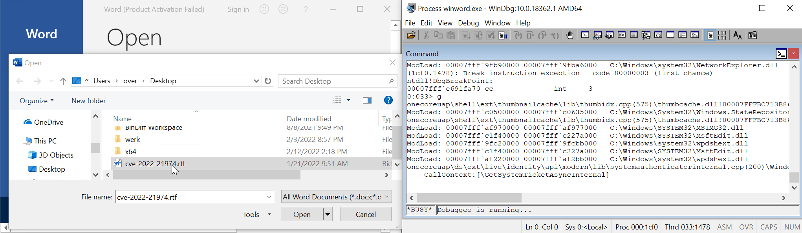

# CVE-2022-21974: Unitialized pointer free in RMSRoamingSecurity Remote Code Execution

<p align='center'>

</p>

## Root-cause

The `RMSRoamingSecurity!ATL::CComCreator<ATL::CComObject<CRmsRoamingSecurity> >::CreateInstance` constructor allocates and initializes a `CRmsRoamingSecurity` object (0x3470 bytes) but it fails to initialize completely its state.

For example, at offset 0x3458 there is an uninitialized pointer that gets free'd when the destructor is invoked (in `CRmsRoamingSecurity::_Cleanup`):

```
0:000> 
RMSRoamingSecurity!CRmsRoamingSecurity::_Cleanup+0x29:
00007ffd`719767a5 488b8b58340000  mov     rcx,qword ptr [rbx+3458h] ds:000001c6`612f9fe8=c0c0c0c0c0c0c0c0

0:000> p
RMSRoamingSecurity!CRmsRoamingSecurity::_Cleanup+0x30:
00007ffd`719767ac 4885c9          test    rcx,rcx

0:000> 
RMSRoamingSecurity!CRmsRoamingSecurity::_Cleanup+0x33:
00007ffd`719767af 7414            je      RMSRoamingSecurity!CRmsRoamingSecurity::_Cleanup+0x49 (00007ffd`719767c5) [br=0]

0:000> 
RMSRoamingSecurity!CRmsRoamingSecurity::_Cleanup+0x35:
00007ffd`719767b1 48ff15e0b90000  call    qword ptr [RMSRoamingSecurity!_imp_CoTaskMemFree (00007ffd`71982198)] ds:00007ffd`71982198={combase!CoTaskMemFree (00007ffd`ce8454d0)}
```

This is the function using the uninitialized data, see `[0]` and `[1]`:

```c++
void __fastcall CRmsRoamingSecurity::_Cleanup(struct_v7 *this)
{
  void *v2; // rcx
  void *qword3460; // rcx
  void *qword33E8; // rcx

  if ( this->qword33E0 )
  {
    IpcFreeMemory();
    this->qword33E0 = 0i64;
  }
  v2 = *(void **)&this->gap33F0[104];      // <--- [0] uninitialized
  if ( v2 )
  {
    CoTaskMemFree(v2);                     // <--- [1] free
    *(_QWORD *)&this->gap33F0[104] = 0i64;
  }
  //...
}
```

## Repro

1. Turn on PageHeap via Gflags on `winword.exe`
1. Start Word, attach a debugger to it
1. Open `cve-2022-21974.rtf` in Word

```
(12f0.2f64): Access violation - code c0000005 (first chance)
First chance exceptions are reported before any exception handling.
This exception may be expected and handled.
verifier!AVrfpDphFindBusyMemoryNoCheck+0x8a:
00007ffd`7a4c4742 817ac0bbbbcdab  cmp     dword ptr [rdx-40h],0ABCDBBBBh ds:c0c0c0c0`c0c0c080=????????

0:000> kc
 # Call Site
00 verifier!AVrfpDphFindBusyMemoryNoCheck
01 verifier!AVrfpDphFindBusyMemory
02 verifier!AVrfpDphFindBusyMemoryAndRemoveFromBusyList
03 verifier!AVrfDebugPageHeapFree
04 ntdll!RtlDebugFreeHeap
05 ntdll!RtlpFreeHeap
06 ntdll!RtlpFreeHeapInternal
07 ntdll!RtlFreeHeap
08 RMSRoamingSecurity!CRmsRoamingSecurity::_Cleanup
09 RMSRoamingSecurity!ATL::CComObject<CRmsRoamingSecurity>::~CComObject<CRmsRoamingSecurity>
0a RMSRoamingSecurity!ATL::CComObject<CRmsRoamingSecurity>::`vector deleting destructor'
0b RMSRoamingSecurity!ATL::CComCreator<ATL::CComObject<CRmsRoamingSecurity> >::CreateInstance
0c RMSRoamingSecurity!ATL::CComClassFactory::CreateInstance
0d combase!CServerContextActivator::CreateInstance
0e combase!ActivationPropertiesIn::DelegateCreateInstance
0f combase!CApartmentActivator::CreateInstance
10 combase!CProcessActivator::CCICallback
11 combase!CProcessActivator::AttemptActivation
12 combase!CProcessActivator::ActivateByContext
13 combase!CProcessActivator::CreateInstance
14 combase!ActivationPropertiesIn::DelegateCreateInstance
15 combase!CClientContextActivator::CreateInstance
16 combase!ActivationPropertiesIn::DelegateCreateInstance
17 combase!ICoCreateInstanceEx
18 combase!CComActivator::DoCreateInstance
19 combase!CoCreateInstanceEx
1a combase!CoCreateInstance
1b ole32!wCreateObject
1c ole32!OleLoadWithoutBinding
1d ole32!OleLoad
```

I've reproduced this on a Windows 10 x64 VM and on Windows 11 x64 with both Wordpad (but requires one click) and Office Word 2019.
